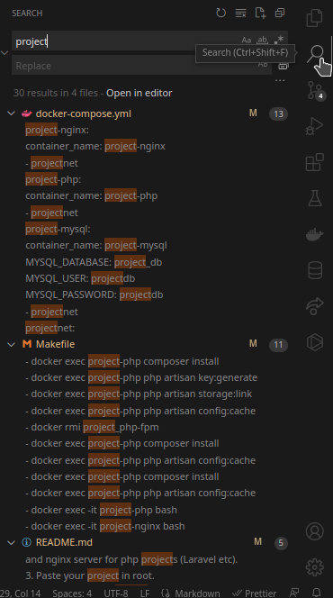

# Docker PHP-fpm and NGINX

Repository to save docker image with php-fpm and nginx server for php projects (Laravel etc).

### Requirements
 
- [docker](https://docs.docker.com/get-docker/) and [docker-compose](https://docs.docker.com/compose/)

### Installation

1. Clone the repository.
```sh
git clone https://github.com/matheusdearaujo/docker-php-nginx.git
```

2. Change directory.

```sh
cd docker-php-nginx
```

3. Paste your project in root.
4. Change all texts "project" to your project name.


5. Run docker.
- With Makefile

```sh
make install
```
- Manually
```sh
docker-compose up -d --build
docker exec <PROJECT_NAME> composer install
docker exec <PROJECT_NAME> php artisan key:generate
docker exec <PROJECT_NAME> php artisan storage:link
sudo chown -R 33:33 bootstrap/ storage/
docker exec <PROJECT_NAME> php artisan config:cache
```
